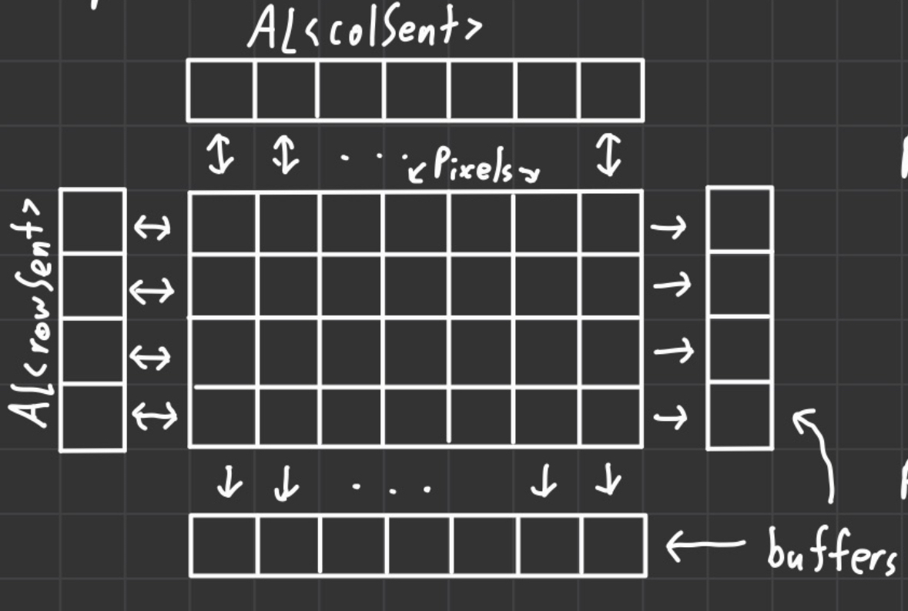
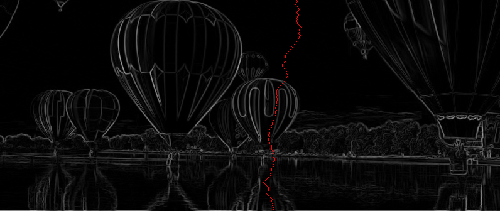
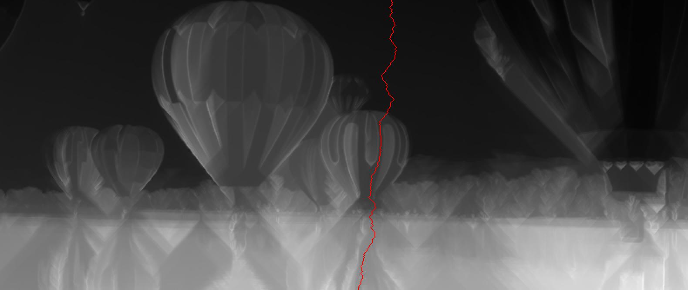

# Image Compressor with Seam Carving Algorithm

## Overview

This Image Compressor analyzes pixel data within a given image to compute the path of least energy through the image so that when the path is removed, the least amount of data is lost from the image as a whole.

## Functionality

- Use the color differences between neighboring pixels to compute an "energy" for each pixel, determining how important it is to the image.
- Find the path from top to bottom (or left to right) on the image that removes the least amount of total energy worth of pixels.
- Remove that "seam" of pixels while maintaing the shape of the data, storing it so that the seam can be added back into the image in the future.

## Constraints

- **Speed**:
  - Required a solution that did not involve the recalculation of every pixels energy every time, as only a subset of pixels would need to be updated.
  - Pixels needed easy way to access neighbors.
  - Because seams could be diagonal, could not compare every posssible seams energy loss. Required dynamic programming approach.
- **Data Structure**:
  - Representation of image needed ability to change size while still being able to access every pixel.
  - Abstracting the removal vertical/horizontal seams required a specific class structure with the ability to iterate through rows or columns
  - In order to accomodate for the needs of the project, utilized a 2-dimensional Deque with custom sentinels and buffers

## Skills Demonstrated

- **Object Oriented Design**: utilized interfaces, abstract classes, and inheiritance within a complex object design that allowed for an elegant solution.
- **Linked Lists**: Using a 2-dimensional Deque to represent data meant no direct acces to individual pixels, and every pixel could only be accessed through neighboring pixels or helper pieces (sendinels on the top and left, buffers on the right and bottom).
- **Dynamic programming**: Used a heavily accumulator based algorithm to compute the seams of the image from the top down as opposed to bottom up.

## Computation Tequinique

The process of removing a seam essentially breaks down into three steps:

- Compute the "energy" of each pixels, which represents how different that pixels brightness is compared to its 8 neighbors. - For each pixel, let the brightness of the 8 neighbors on a scale from 0 to 1 be denoted by TL, TM, TR, ML, MR, BL, BM, BR. The horizontal, vertical, and total energy of any pixel can be defined as:
  $$
  \begin{equation}
    Horizontal Energy = (TL+2ML+BL)-(TR+2MR+BR)
  \end{equation}
  $$
  $$
  \begin{equation}
    Vertical Energy = (TL+2TM+TR)-(BL+2BM+BR)
  \end{equation}
  $$
  $$
  \begin{equation}
    Energy = \sqrt{Horizontal Energy^2 + Vertical Energy^2}
  \end{equation}
  $$
- Find a path of pixels from top to bottom (or left to right) with the least possible combined energy of all pixels in the path. This is called a seam in this project.
  - Start with the top row (or left column), every pixels seam of least energy down to it from the top is only its own energy. Store this value in each of the pixels as the total seam weight.
  - Go to the next row below (or column to the right), for each pixel, find the pixel above it (either TL, TM, or TR) with the lowest total seam weight. Add that weight and its energy to produce its total seam weight. Store the pixel above it with the least seam weight as a field in the pixel.
  - repreat this process until the last row is calculated, at which point every pixel in the bottom row (or right column), will have the total weight of the least expensive seam that ends with that pixel. Find the pixel with the least total weight, and use the stored pixels above it to have a linked list of the seam with the least total energy of the entire image.
  - For a grid of pixels with the energies on the left, this calculation would look like:  
    
    
- remove the seam, fixing the data structure and making necessary re-calculations along the way.
  - Go through the linkedlist of the least costly seam, and have each pixel remove itself.
  - Pixels will fix their left/right connections, and connections below them. Cannot fix connections above as there are pixels above that have not been removed yet.
  - recalculate the energies of only the pixels 2 to the left or right of every removed pixel as these are the only pixels in the image whose energies can be changed.

Adding the seams back is then just a matter of saving the lead sentinel for each seam, along with its position in the sentinel arraylist (described below). Then, the sentinel can be inserted back into the arraylist, and tell each of the pixels in the seam to re-connect themselves. This works because removed seams still point at pixels in the image, but those pixels do not point at it after its removal.

## Data Structure

The Core class structure of this project is designed as follows:

- Grid Piece (interface): represents any piece that a pixel can be pointed to by a pixel
  - Edge Pieces (abstract, implements Grid Piece): represents any grid pieces that boarders the grid of pixels
    - Row Sentinel (extends Edge Piece): represents a sentinel at the Left of each row that points right to the first pixel of that specific row.
    - Column Sentinel (extends Edge Piece): represents a sentinel at the top of each column that points down to the top pixel of that specific column.
    - Buffer (extends Edge Piece): represents a piece that pixels on the right/bottom edge point to for their right/down fields
  - Pixel (implements Grid Piece): points to its four neighboring grid pieces in each cardinal direction
- Image Graph: represents an image, contains two ArrayLists, rows and columns, which each contain the row and column sentinelsthat point into the image.
- Seam Info: associated with each Pixel, keeps track of the path of the seam that pixel is in, as well as the total weight of the seam to that point.

With this design, everything can be accessed via a given image graph object, which can use its row or column sentinels to interate through the image either row by row or column by column. This idea is best understood with the diagram below:

In general, most of the process described above are then done by iterating through either the row or column arraylist, and retrieving an iterable from each sentinel that contains every pixel in that row/column. This means a method can easily be called on every pixel. It is also important to note that the first and last row/column are also very easily accessable, making seam calculation/removal much simpler.

## Bells and Whistles

In addition to displaying the normal image, there is also an option to display either the energies of each pixel, or the total weight of the minimum seam up to any given pixel in the image. Note that for the total weight, the image will get progressively lighter as the weight inevitably increases, but the darkest path from top to bottom represents the path of least resistance, highlighted by the red line.

\*This project was done in collaboration with [Zach Croft](https://www.linkedin.com/in/zachary-croft-67316b298/)\*
